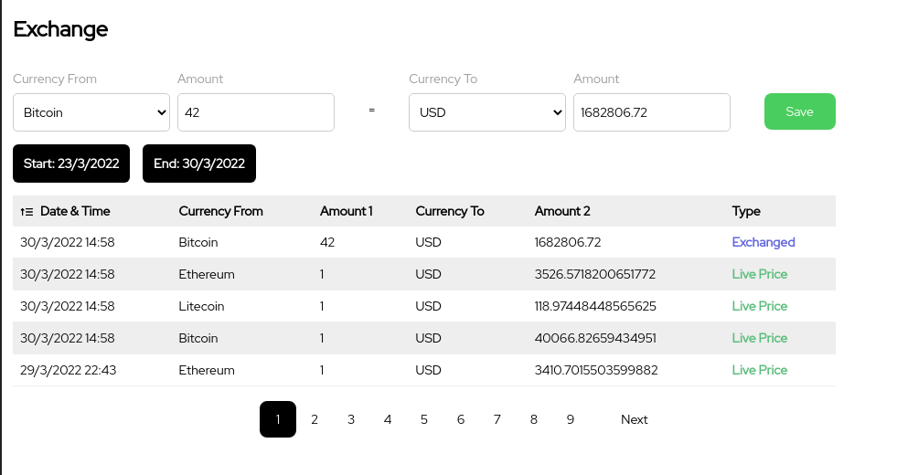

# How to run

## Classic

- You will need to have a valid URL for MongoDB. (I used a simple container)
- You will need obviously the environment set up for react.js and node applications

Add a .env file with the following content:

```python
APIKEY='<coinapi_API_KEY>'
NODE_ENV='development'
PORT=3001
POLLING_MINUTES=5 # this is the configurable time to get new data.
```

if you don't have a coinapi key it will mock some data with a predefined range for Ethereum, Bitcoin and Litecoin.

- running server:

```bash 
$ ~ cd <project_folder>/server && npm i && npm start
```
- running react:

``` bash
$ ~ cd <project_folder>/client && npm i && npm start
```
---

## Dockerfile

> You will need to have already running a mongoDB container.

You could build the single images through the dockerfile and run the containers with the following command:

```bash
$ ~ cd <project_folder>/client && docker build -f Dockerfile -t client .

$ ~ docker run -it -p 3000:3000 client
```
```bash
$ ~ cd <project_folder>/server && docker build -f Dockerfile -t server .

$ ~ docker run -it -p 3001:3001 server
```
---
## Docker Compose

the application is provided with a docker-compose file. Sadly this is not working with a local img of MongoDB, I suspect that has something to do with the network and the allowed port on the MongoDB container.
The idea was to expose only the port 3050 to redirect everything with a reverse proxy with NGINX. Sadly I've been overwhelmed by job duties and I couldn't finish this part as I wanted.

For the time being, it does work with a MongoDB Atlas (sadly is protected by the IP whitelist so you will need to configure one) istance and exposing directly the ports for the client and the server without using the reverse proxy.

---

# Preview

The app is a simple React application, it fetches data from the backend to get the current price of the cryptocurrencies.
Once the data is fetched, it is displayed in a table with the type "Live Price". If the user wants to know the value based on the latest price he can use the top part of the application to convert it in Euros, GBP or USD. This data are not fetched for convenience but they are hardcoded in this application.

If the user wants to save the conversion done, he can click on Save and a new Row with type "Exchanged" will be added to the table (Only if on the first page) through WebSockets.

the data are stored in a MongoDB database. the rows can be sorted by all the columns (both ascending and descending) and the user can filter the data by the date.



# Known bugs

This is a mock application, I think it demonstrates that all the basis are there from copying the design to sorting out the logic. I usually have more experience with SQL databases and Angular, so bear in mind that my MongoDB and React choices may be not optimals.

## Issues:
- the page numbers on the bottom are not limited, it will grow as the rows are created. It should be eventually limited showing the first pages, the last ones, and eventually the pages just before and after the current page.
- the numbers are not always cut to n digits.
- the Errors are not managed in some cases.
- the currency rate for EUR, GBP and USD are hardcoded.